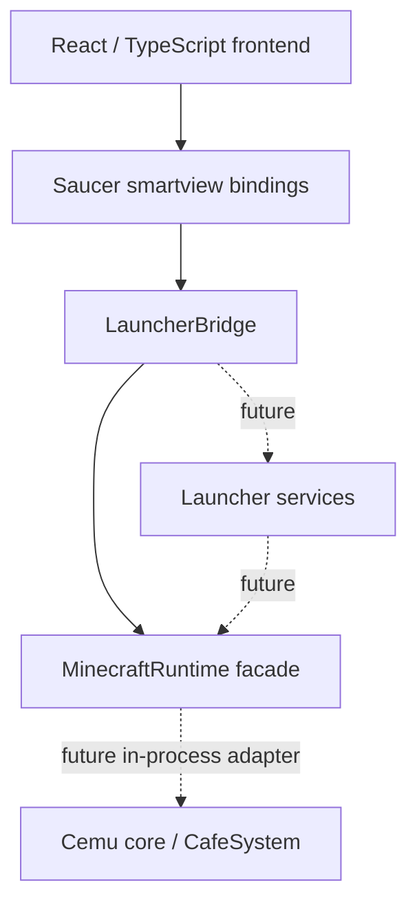
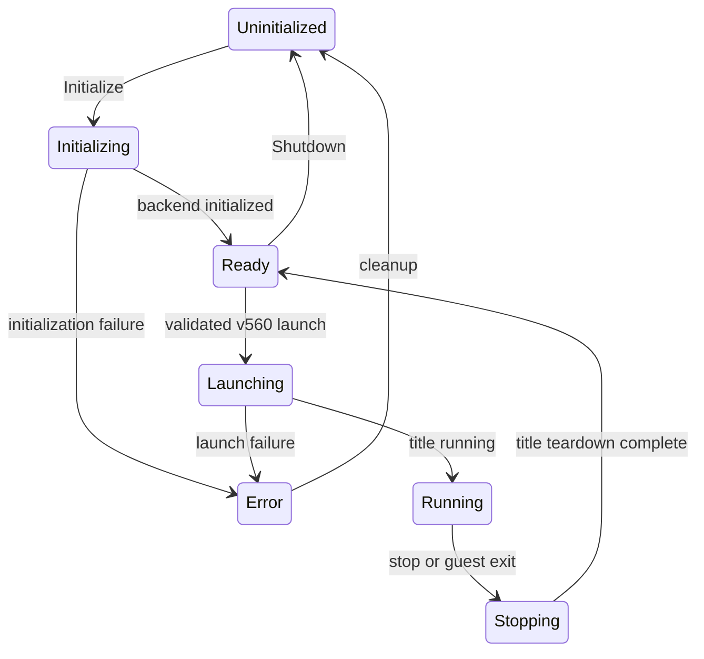

# MCWiiU Launcher — Architecture v1

## Goals and product scope

Build a small, reproducible Windows x64 application foundation for Minecraft:
Wii U Edition **Patch 35 / v560 only**, supporting USA, EUR and JPN. The final
product embeds the Cemu fork in the **same process** as the launcher; spawning a
separate Cemu executable is not the runtime architecture.

Architecture v1 ships a Saucer/WebView2 window, embedded React/TypeScript UI,
working native queries, and an explicit runtime facade. It does not launch games.
No game/account data or known-good RPX hashes are included. No World manager,
Save manager, save import/export, or automatic save backup will be implemented.
Other games and operating systems are outside the product scope. Existing
upstream platform code is retained to keep maintenance differences small.

## Components and ownership



- `launcher/frontend`: product UI, localized-copy boundary and typed asynchronous
  binding declarations. It knows no Cemu classes, filesystem paths or secrets.
- `launcher/native/app`: application composition, Saucer event loop, binding
  registration, window/webview lifetime, navigation policy and startup errors.
- `LauncherBridge`: allowlisted, read-only public queries. `getAppInfo()` returns
  product/architecture/build information, live runtime state and integration
  availability. `getRuntimeState()` reads the same facade, not a frontend constant.
- `MinecraftRuntime`: C++20 lifecycle/state boundary, owned by the application.
  Its v1 backend is explicitly unavailable: `Initialize()` returns false and
  leaves `Uninitialized`. No `Ready`/`Running` claims are fabricated. `Shutdown()`
  and destruction are idempotent. There are no launch/stop bindings yet.
- `platform/windows`: resolves WebView2 storage through Windows LocalAppData,
  independently of the executable's current directory.
- Existing `src/` and dependency submodules remain Cemu-derived code. A separate
  `CemuBin` still exists during migration; the v1 shell does not link Cemu core.

The startup coroutine owns runtime, bridge, window and webview until
`application::finish()`. Reverse destruction releases the webview and window
before their bridge/runtime references. Queries execute on Saucer's UI thread.
Future runtime work must use a dedicated owner thread with synchronized snapshots
and queued commands; rendering/UI cadence must not drive runtime lifecycle work.
No global runtime or additional singleton is introduced.

## Cemu integration seam

Current `src/main.cpp::CemuCommonInit()` initializes configuration, graphics
drivers, exception handling, input, audio, GraphicPack2 and CafeSystem together.
`src/gui/wxgui/CemuApp.cpp::OnInit()` calls it from the wxWidgets application.
`CafeSystem` exposes `Initialize`, `SetImplementation`, `PrepareForegroundTitle`,
`LaunchForegroundTitle`, `ShutdownTitle` and `Shutdown`; its `SystemImplementation`
callbacks recreate the canvas and signal emulated process exit. Renderer/window
ownership and teardown must be adapted before any of these are used by Saucer.
Calling the legacy entry point directly would also initialize unrelated UI/data
paths. Architecture v1 deliberately does not do this or remove wxWidgets.

The next runtime phase introduces a narrow C++20 in-process adapter behind
`MinecraftRuntime`, preserving CafeSystem APIs and keeping frontend dependencies
out of core. It must resolve shared configuration and native TV render-window
ownership before reporting `Ready`. Windows Cemu currently selects the static
MSVC CRT, while the independent launcher uses the default dynamic CRT. Align CRT
selection and allocation ownership before linking Cemu into the launcher; the
standalone Cemu verification reports CRT mixing warnings (LNK4098/LNK4286).
The desired lifecycle is:



All transitions above are **planned**, except v1's persistent `Uninitialized`
state and idempotent shutdown. Mods/textures changes will require a stopped game.

## Build and dependency layout

The workspace separates ownership:

```text
workspace/
  MCWiiU-Launcher/     tracked source/configuration/documentation only
  _work/
    build/{debug,relwithdebinfo,release}/
    frontend/         external frontend maintenance staging
    tests/            temporary verification only
    temp/ cache/vcpkg/ codex/ staging/ logs/
  _artifacts/         portable/ installer/ symbols/
  _local/             game/ dumpling/ mods/ textures/ (user supplied)
```

Build-tree output inside the repository is rejected. Existing tracked `bin/`
and `dist/` are upstream resources, never new output destinations. `CemuBin`
now emits to its external build tree's `bin/<configuration>`. Non-bundle
executables retain adjacent `resources` and `gameProfiles` through a
post-build copy of the tracked upstream resource directories. Legacy Visual
Studio `CMakeSettings.json` also uses sibling `_work` directories.

Saucer **v8.0.5**, commit `68345fa45a7465fe5a62b699b51847b916c8c16a`, is pinned
with FetchContent. Its own fixed dependency versions and WebView2 NuGet SDK are
obtained outside the repository. Backend is explicitly `WebView2`, architecture
`x64`; examples/tests are disabled. Saucer needs MSVC 19.44+ and a recent Windows
SDK. Launcher builds require CMake 3.31+ (the official embed helper uses CMP0174),
Visual Studio 2022, Node 22.12+ and npm. Cemu stays C++20; only Saucer, its generated
embedding target and `MCWiiULauncher` use C++23.

The frontend source and npm lockfile are tracked. CMake copies them to
`<binaryDir>/launcher/frontend`, runs `npm ci`, checks TypeScript and builds Vite
there. Source/configuration edits trigger reconfiguration through configure
dependencies. Input fingerprints avoid redundant installs/builds. Stable asset
names plus re-enumeration keep the embedded asset list current. The official
`saucer_embed` helper receives an **absolute external DESTINATION**; its default
relative destination would put generated code in the source tree. The app uses
`embed(saucer::embedded::all())` and `serve("/index.html")`, with no dev server or
loose frontend files required at runtime. Never run npm install/build in the
tracked frontend directory. Lockfile updates also belong in external staging.

Launcher presets isolate the shell from Cemu's heavy dependencies. Original
Cemu builds default to `CEMU_BUILD_RUNTIME=ON`, `MCWIIU_BUILD_LAUNCHER=OFF`.
Both options can be enabled for eventual side-by-side development. Cemu's vcpkg
toolchain is cloned locally at the exact submodule revision into the external
build tree, so bootstrap tools/buildtrees/packages never dirty the submodule.
A changed submodule revision requires a fresh external build tree. Downloads
and binary cache directories are sibling `_work/cache/vcpkg` in the Cemu preset.
The preset uses vcpkg's pinned downloaded tools rather than unrelated MSYS tools
that may also be present on PATH.
Windows/vcpkg libusb discovery uses native CMake include/library searches with
separate Debug/Release locations, preserving workspace paths containing spaces
that pkgconf splits in its flag output. Other platform discovery is unchanged.
The existing Cemu CI workflow uses an external runtime build tree and stages
upstream Windows/AppImage/macOS packaging externally before artifact collection.
This retains upstream packaging; it does not implement a launcher installer or
add non-Windows support to the launcher.

From the repository root, with native Git/CMake/Node available on PATH:

```powershell
cmake --preset launcher-debug
cmake --build --preset launcher-debug
cmake --preset launcher-development
cmake --build --preset launcher-development
cmake --preset launcher-release
cmake --build --preset launcher-release

# Existing wxWidgets runtime, independent of the shell:
cmake --preset cemu-development
cmake --build --preset cemu-development
```

The output is `_work/build/<variant>/bin/<configuration>/MCWiiU Launcher.exe`.
Install only after validation with `cmake --install <binaryDir> --config Release
--component Launcher --prefix <external staging directory>`. Final distributable
artifacts belong in `_artifacts`; updater/installer packaging is a later phase.
Machine-specific settings/presets and AGENTS.md remain local-only via Git's local
exclude file, never public commits. No permanent test suite is introduced in v1.

## Development and Release

`MCWIIU_DEVELOPMENT` is 1 for Debug/RelWithDebInfo and 0 otherwise. Native build
configuration is the sole UI source of this distinction. Only development builds
register `openDevTools`; Release has no such binding or normal UI control.
DevTools start closed and context menus are disabled. Future low-level diagnostics
must respect this boundary and redact private data. Planned Development diagnostics
cover Cemu logs, builds, RPX/modules, mods, patch conflicts, network, performance
and selected low-level Cemu diagnostics.

## Runtime data, privacy and trust

Installed runtime data belongs under `%LOCALAPPDATA%/MCWiiU Launcher/`, with
WebView2 in `WebView2/`. Future settings/cache/runtime content directories must be
managed by platform/services rather than frontend paths. `_local` is development
user-supplied input, never distribution content. Cemu's internal runtime storage
may hold native game data; that creates no launcher Save/World management feature.

Only the embedded `saucer://embedded` origin may navigate the privileged webview;
new windows/external navigation are blocked. Frontend CSP constrains resources to
self; `unsafe-inline` scripts are required by Saucer's injected RPC resolution.
There is no remote page or generic arbitrary-file/command binding. Certificate,
otp/seeprom/account/password/key contents must never cross this bridge or appear
in source/logs/test fixtures/screenshots/Git. Account diagnostics reveal only
Present/Missing/Valid/Invalid status. Game/update/DLC and user mods/textures are
never bundled. Future crash handling must maintain the same constraints.

## Future service boundaries and validation

Add services when used, not empty classes up front:

- **GameImport/BuildValidation:** drop/folder input, Base/Update/optional DLC and
  parent discovery; reject non-v560. Validate title ID/type/region/version, RPX
  SHA-256 and Cemu module hash. Separate USA/EUR/JPN identities; hashes are
explicitly unset until measured from known-good user dumps. No modified RPX.
- **Settings/Input:** one configuration authority, native Vulkan/OpenGL,
  720p/1080p/1440p/2160p and 60–500 FPS/Unlimited; no Graphic Pack graphics settings.
  Xbox/DS4/DualSense/Switch Pro mapped to Wii U GamePad, TV output only, button
  mapping and left/right deadzones; no keyboard/mouse gameplay or sensitivity/
  vibration-strength settings.
- **Accounts/Network:** Dumpling import and per-account Offline/Pretendo/Plasma
  provider. No account creation, official Nintendo or public Custom provider UI.
- **Mods:** stopped-game enable/disable; legacy Cemu patches/GraphicPack internals,
  optional simple `manifest.json` metadata, CemuModKit ASM. Public UI says Mods; no host
  DLL injection, initial hot reload or separate native mod loader.
- **Textures:** TexNX `Common/res` directory/pack/ZIP import, one pack, Default
  restoring stock Common, no manifest; safe stopped-game replacement only.
- **Updates/Recovery:** optional GitHub Releases/manifest, dedicated updater,
  SHA-256/signature checks; users may decline and keep old versions. Future crash
  logs/dumps/recovery/safe mode (mods off, defaults, OpenGL fallback).

Navigation is Home / Play / Mods / Textures / Accounts / Settings. In v1 only
Home is active and the future destinations are disabled. Full import, hashes,
game launch, network, account/mod/texture managers, graphics/input settings,
updater, installer and debugger migration are intentionally deferred.

Build/link success proves structure, not game compatibility. A shell smoke check
must confirm the window, embedded frontend and live native queries separately.
Game acceptance requires later validated dumps and actual runtime tests.

The initial known-good validation records are explicitly unconfigured:

| Region | RPX SHA-256 | Cemu module hash | Launch acceptance |
| --- | --- | --- | --- |
| USA | Unset | Unset | Unavailable |
| EUR | Unset | Unset | Unavailable |
| JPN | Unset | Unset | Unavailable |

These are policy placeholders, not a usable hash database. Future validation must
store each record by region with title ID/type/version and never interpret an
unset identity as a match.

## Upstream maintenance

Keep `upstream = https://github.com/cemu-project/Cemu.git` locally. Preserve
submodule pins and upstream source layout; cherry-pick only needed fixes, resolve
them narrowly, and verify both shell and Cemu targets. The v1 Cemu changes are
build selection, external dependency bootstrap, binary output paths and Windows
libusb path handling. New product behavior belongs behind launcher/service/runtime seams.

## API references

- [Pinned Saucer source](https://github.com/saucer/saucer/tree/68345fa45a7465fe5a62b699b51847b916c8c16a)
- [Saucer application setup](https://saucer.app/getting-started/hello-world/),
  [typed interop](https://saucer.app/webview/interop/), and
  [official asset embedding](https://saucer.app/webview/embedding/)
- [CMake Presets](https://cmake.org/cmake/help/latest/manual/cmake-presets.7.html)
- [WebView2 debugging for smoke verification](https://learn.microsoft.com/en-us/microsoft-edge/webview2/how-to/debug-visual-studio-code)
